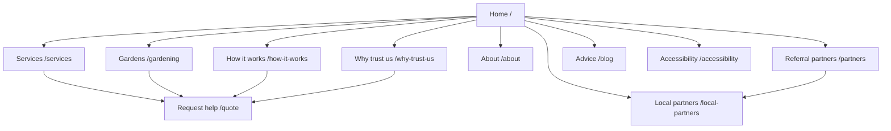
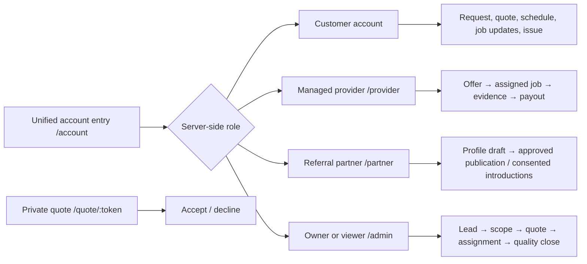
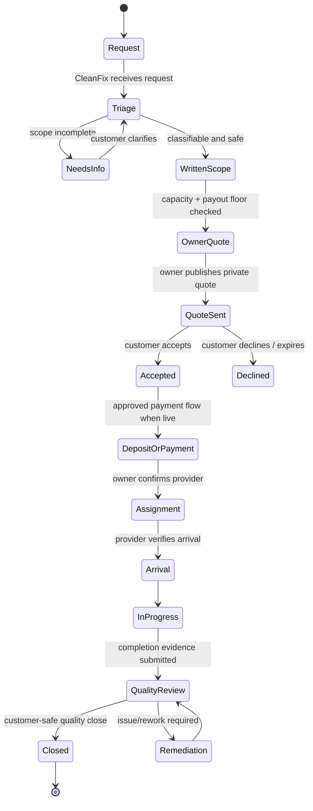

# CleanFixHarish sitemap and low-fidelity wireframes

**Status:** production-planning baseline  
**Version:** 1.0  
**Owner:** CleanFixHarish  
**Last reviewed:** 7 September 2026

## Purpose and source-of-truth boundaries

This is the canonical information-architecture and low-fidelity wireframe brief for the public website, customer service journey, managed-provider workspace, independent referral-partner studio, and owner/admin workspace. It is deliberately a build specification, not a claim that every screen is live.

The governing business rules remain `COMPANY_SOURCE_OF_TRUTH.md` and `PRODUCT_CONTRACT_P0.md`. In particular:

- CleanFixHarish is the customer-facing contracting party for Core and partner-assisted work; it is not an open marketplace.
- A **managed provider** and an **independent referral partner** are separate, isolated relationships. A provider never receives customer price/margin or a reusable customer directory; an independent partner never receives managed-job data.
- Material decisions (quote, payout, assignment, change order, refund, rework, payout, quality close) require server-authorized owner action.
- Empty states show real empty states, never fabricated customers, providers, jobs, ratings, counts, or balances.

### Artifact audit

No dedicated sitemap or wireframe document existed when this was written. The repository does contain an implemented React route map, a blog-only sitemap generator, an Android customer-app foundation, `UX_CONVERSION_AUDIT.md`, and product/operating contracts. Those are valuable inputs, but they do not provide an end-to-end, role-safe responsive screen specification. This document fills that gap.

## People, roles, and entry points

| Person | Goal | Safe entry point | Primary destination | Never expose |
| --- | --- | --- | --- | --- |
| Anonymous visitor | Understand service and ask for help | Public pages, WhatsApp, request form | `/quote` confirmation | Provider identity as an advertiser, internal operations, private quotes |
| Customer | Request, review scope/quote, track a job, report an issue | `/account`; signed private quote link | customer account and customer-safe job/status views | Provider payout, internal notes/margin, other customers |
| Managed provider | Respond to an offer and fulfill assigned work | `/account?type=business` → `/provider` | offers, active job, evidence, payout state | Customer details before confirmed assignment; customer price/margin; unrelated jobs |
| Independent referral partner | Maintain an approved public profile and receive consented introductions | `/account?type=business` → `/partner` | profile draft, consented introductions, verification/billing | CleanFix-managed jobs or customer data without specific consent |
| Owner/admin | Qualify, quote, dispatch, oversee quality and publish content | unified sign-in → server routes role to `/admin` | operational dashboard | Nothing is hidden from this role, but all material actions are auditable |
| Read-only viewer | See masked, approved operations information | unified sign-in → `/admin` in viewer mode | masked dashboard | PII, media, exact addresses, tokens, money, controls, exports |

There is one public authentication entrance. Authentication proves identity; server-side role records determine authorization and final destination. Do not add a public “admin login” link.

## Sitemap and navigation model

### Indexable public routes



| Route | Navigation label / purpose | Primary action | Production note |
| --- | --- | --- | --- |
| `/` | Home; local managed-service promise | Request service / WhatsApp | Retain service-area clarity and an honest proof/quality message. |
| `/services` | Approved service taxonomy | Choose a service → request | Keep Core, partner-assisted and referral-only language accurate. |
| `/gardening` | Gardening service explainer | Start conversation/request | Must not promise a provider, schedule or price before scoped review. |
| `/how-it-works` and `/how-we-work` | Customer process education | Request service | Consolidate to one canonical URL with a permanent redirect before SEO release. |
| `/why-trust-us` | Accountability, privacy and resolution approach | Request service | Use substantiated claims only; never imply unearned reviews/certifications. |
| `/partners` | Referral-only disclosures and eligible listings | View a disclosed independent business / ask for introduction | Never represent managed providers as public marketplace listings. |
| `/local-partners` | Directory landing | Request a consented introduction | Clearly state independent contract/payment/remedy relationship. |
| `/about` | Company identity and local context | Request service | Keep operating area and contact details current. |
| `/blog/`, `/blog/:slug` | Search/education content | Request service | Publish only reviewed content; add canonical URL and structured data per post. |
| `/quote` | Service request intake | Submit request | First conversion destination; no price promise. |
| `/accessibility` | Accessibility statement and support route | Adjust preferences / contact support | Claims must match current implementation and testing. |

**Public global navigation:** Home, Services, Gardens, How it works, Why trust us, Referral partners, About. Persistent utilities: language, accessible install guidance, WhatsApp, Request service, and My dashboard / Sign in. On narrow viewports these become one labelled menu plus a persistent Request service action; do not rely on icon-only navigation.

### Non-indexable and protected routes



| Route group | Indexing | Required guard and behavior |
| --- | --- | --- |
| `/quote/:token` | `noindex` | Expiring, unguessable quote token; show only customer-safe scope, total, deposit, terms, expiry and accept/decline. |
| `/account` | `noindex` | Authentication required; customer or business account shell. Return destination must be allow-listed. |
| `/provider/*` | `noindex` | Authentication, business relationship and server-side managed-provider authorization. Data must be job-scoped. |
| `/partner/*` | `noindex` | Authentication, business relationship and server-side referral-partner authorization. Data must be consent-scoped. |
| `/admin` | `noindex` | Server-validated owner/viewer role. Viewer is masked/read-only. |
| `/auth/*` | `noindex` | Callback/error only; concise recovery and no sensitive diagnostic data. |

## Customer journey and screen hierarchy

### Journey states



Each transition is an explicit state with an event history—not a decorative progress bar. A customer sees only a plain-language, customer-safe subset such as **Request received → We are clarifying the work → Your quote is ready → Scheduled → Work in progress → Quality follow-up → Complete**. Never reveal provider-offer failures, internal queue data, margin, internal notes, or other customers.

### C1. Public homepage/service landing

```text
Desktop (12 columns)
┌──────────────────────────────────────────────────────────────────────────┐
│ Logo | public navigation                              HE/EN | Account   │
│                                                            WhatsApp | CTA │
├───────────────────────────────┬──────────────────────────────────────────┤
│ Eyebrow: Harish local service │ Credible local/project visual             │
│ H1: What we coordinate        │ [alt text; labelled if illustrative]     │
│ Proof: scope → quote → care   │                                          │
│ [Request service] [WhatsApp]  │                                          │
├───────────────────────────────┴──────────────────────────────────────────┤
│ Services (cards) | How it works (three/five clear steps) | Trust/FAQ     │
├──────────────────────────────────────────────────────────────────────────┤
│ Referral-only disclosure (when applicable) | Footer/legal/accessibility  │
└──────────────────────────────────────────────────────────────────────────┘

Mobile (single column)
┌────────────────────────┐
│ Logo  HE/EN  Menu       │
│ H1 and one-line proof   │
│ [Request service]       │
│ [WhatsApp]              │
│ Image                   │
│ Services as 1-up cards  │
│ Steps / FAQ / footer    │
└────────────────────────┘
```

Rules: one visible primary conversion action above the fold; secondary WhatsApp option; no carousel dependency; honest supporting evidence; large touch targets (44×44 CSS px minimum); phone numbers render LTR even in Hebrew.

### C2. Request service (`/quote`)

```text
┌──────────────────────────────────────────────────────┐
│ Back to services             Step 1 of 2: Tell us     │
│ H1: What needs attention?                              │
│ Service*  | Area                                      │
│ Name*     | Phone* (LTR)                              │
│ WhatsApp (optional; LTR)                              │
│ Describe the work / access / preferred time           │
│ [Continue / Submit request]                           │
│ “We review the scope before sending a written quote.” │
│ Prefer a conversation? [WhatsApp]                     │
└──────────────────────────────────────────────────────┘
```

Current implementation is a single submit screen. Production target: preserve the short form but add a review/consent step only when legally approved (contact channel, privacy notice, and optional media upload); draft locally only with consent and a clear retention policy. Success state must provide request reference, expected *non-guaranteed* next step, account/sign-in option, and WhatsApp fallback. Do not state an unverified response-time SLA.

### C3. Customer account and private quote

```text
Customer account
┌─────────────────────────────────────────────────────────────┐
│ Account | My requests | Messages | Help | Profile            │
├─────────────────────────────────────────────────────────────┤
│ Current request: CF-1234  [status: Quote ready]              │
│ Next safe action / plain-language status                      │
│ [View private quote] [Ask a question]                         │
├─────────────────────────────┬───────────────────────────────┤
│ Previous requests (real only)│ Contact preferences / support │
└─────────────────────────────┴───────────────────────────────┘

Private quote
┌─────────────────────────────────────────────────────────────┐
│ CleanFixHarish | Private quote CF-1234 | Expires 12 Sep      │
│ Total (incl. legally required tax presentation)               │
│ Deposit, if applicable | Scope included | Exclusions | Terms  │
│ [Accept quote] [Ask for a change] [Decline]                   │
│ “No card/payment is collected here until approved flow live.” │
└─────────────────────────────────────────────────────────────┘
```

Post-acceptance, the customer sees appointment window, approved arrival identity/PIN only when assignment is confirmed, work updates, issue reporting, quality outcome and receipt/payment history once those services are released. Before that release, show an explanatory unavailable state—not a non-functioning payment control.

## Managed-provider workspace

The provider workspace is field-first and mobile-first. It is not a public profile or job marketplace. The existing preview establishes the correct privacy posture; live screens below remain **P0 delivery work** until backed by role/object-level APIs.

```text
Provider mobile shell
┌──────────────────────────────┐
│ CleanFix | Jobs | Alerts      │
├──────────────────────────────┤
│ Offers (2) | Active (1)      │  ← segmented control
│ Job CF-1234                  │
│ General area · Tue 10–12     │
│ Written scope summary        │
│ Gross agreed payout          │
│ [Review offer]               │
├──────────────────────────────┤
│ Bottom nav: Jobs | Earnings  │
│             Help | Profile   │
└──────────────────────────────┘

Offer detail → accepted/declined
┌──────────────────────────────────────────┐
│ Job ID | response deadline                │
│ General area, time window, scope          │
│ Materials responsibility, evidence needs  │
│ Gross agreed payout (not customer price)  │
│ [Accept] [Decline]                        │
└──────────────────────────────────────────┘

Active job (after owner-confirmed assignment only)
┌──────────────────────────────────────────┐
│ Status: On the way / Arrived / In progress│
│ Exact address + access, time-limited      │
│ Arrival identity/PIN | checklist          │
│ [Mark on the way] [Confirm arrival]       │
│ [Upload evidence] [Report scope/safety]   │
│ [Submit completion]                       │
└──────────────────────────────────────────┘
```

Provider navigation: Jobs (Offers, Active, History), Earnings, Help, Profile/availability. The default route should be the actionable list, not an analytics dashboard. A new tab never substitutes for an object-level authorization check. Photos are private, scope-linked, upload progress is visible, and offline/weak-network actions are queued only if the server can safely reconcile them with an audit record.

## Independent referral-partner studio

This is a separate workspace, entered by explicit workspace switcher where a business has both relationships. It should use a different accent/label from managed fulfilment so the relationship cannot be confused.

```text
┌─────────────────────────────────────────────────────────┐
│ Independent business studio | Profile | Introductions    │
│ Performance | Verification & billing | Help              │
├─────────────────────────────────────────────────────────┤
│ Relationship status: Draft / Under review / Active       │
│ Profile completeness (only real fields)                  │
│ Legal + trading name | logo | languages | service area    │
│ Claims and media rights | [Save draft] [Submit review]   │
├─────────────────────────────────────────────────────────┤
│ Introductions: only customer-authorized details + consent │
│ ID | consent scope/date | customer message | status      │
└─────────────────────────────────────────────────────────┘
```

Publication and paid/sponsored state must be labelled; payment cannot bypass verification or organic order. Anonymous visits remain aggregate. Never reuse an introduction for marketing without separate valid consent.

## Owner/admin information architecture

Desktop uses a persistent, collapsible sidebar; tablet starts collapsed; mobile uses a labelled bottom bar for the four highest-frequency areas plus a full menu. Keep the implemented navigation groups, but organize the job detail as the operating spine.

```text
Desktop owner workspace
┌───────────────┬───────────────────────────────────────────────────────┐
│ TODAY         │ Page title | search | notifications | account           │
│ • Today       ├───────────────────────────────────────────────────────┤
│ SALES         │ KPI/queue cards (real data only)                        │
│ • Customers   ├───────────────────────┬───────────────────────────────┤
│ • Messages    │ Priority queue        │ Selected lead/job detail        │
│ • Price est.  │ filters + saved view  │ state, audit, next action       │
│ OPERATIONS    │                       │ [authorized action]              │
│ • Jobs        ├───────────────────────┴───────────────────────────────┤
│ • Follow-ups  │ Recent activity / exceptions / handoff                 │
│ PROVIDERS     │                                                         │
│ BUSINESS      │                                                         │
│ WEBSITE       │                                                         │
│ SYSTEM        │                                                         │
└───────────────┴───────────────────────────────────────────────────────┘

Mobile owner workspace
┌──────────────────────────────┐
│ Today                         │
│ Urgent exception cards        │
│ My queue                      │
│ [New request / fast actions]  │
├──────────────────────────────┤
│ Today | Customers | Jobs | Msg│  ← bottom navigation
└──────────────────────────────┘
```

### Admin screen hierarchy

1. **Today** — real operational queue, exceptions, upcoming appointments, follow-ups; an empty state explains what will appear.
2. **Customers / lead detail** — intake, duplicate/relevance/safety check, contact record, written scope, messages, follow-up history. Lead status must map to canonical state; it is not the job record.
3. **Price estimator / quote workbench** — evidence, scope/exclusions, customer total, provider payout floor, tax, owner approval, version history, private publishing link. AI can draft only; owner explicitly approves.
4. **Jobs** — job list and job detail: timeline, assignment offers, confirmed provider, safe customer updates, arrival/PIN, change orders, evidence, quality case, payment and payout state. Use a state transition panel with required reason/evidence fields.
5. **Providers** — vetting, category/licence/insurance evidence, status, availability, payout history. No public ranking controls for managed providers.
6. **Follow-ups / Messages** — conversation record and task queue; WhatsApp deep-links must avoid leaking sensitive data in the URL.
7. **Services & pricing / business rules** — taxonomy, pricing reference controls, approved documents, exclusions, thresholds. All edits are versioned and owner-only.
8. **Website** — share/onboarding, content editor, growth center, video studio. Preview → validate → publish → rollback-to-verified-good workflow; separate content publishing from operational data.
9. **System** — authorized viewers/admins, integration health, platform costs, audit log, settings. Secrets are never displayed back to the browser.

Destructive/high-impact actions (publish quote, assign provider, release address, approve change/refund/payout, restore production) need a clear summary, explicit confirmation, actor/time/reason audit event, and server-side revalidation. Avoid confirmation wording that conceals financial or privacy effect.

## Responsive rules

| Viewport / context | Layout and navigation | Form/table behavior |
| --- | --- | --- |
| 320–479 px phone | One content column; sticky bottom CTA only when it does not hide inputs; public menu sheet; provider uses bottom nav | One field per row; step-based complex flows; cards replace tables; 44×44 targets; keyboard-safe submit bar |
| 480–767 px large phone | One column with paired low-risk fields when legible | Quote/contact forms may pair short fields only; provider evidence picker stays prominent |
| 768–1023 px tablet | 8-column fluid grid; public nav remains menu; admin rail collapses | Two-column cards where reading order remains clear; drawers for job detail; no horizontal data-table dependency |
| 1024–1439 px laptop | 12-column grid; public utility actions may expand; admin sidebar persistent | List/detail split allowed; cap reading widths; tables retain priority columns with details drawer |
| 1440 px+ desktop | Max-width content shell; full public nav; admin dense but breathable | Never stretch prose/forms indefinitely; retain list/detail workspace |
| Android/iOS PWA | Same semantic web flow; install is browser-controlled | Deep links open the correct customer-safe quote/request state; all network errors get recoverable retry/fallback |
| Native Android P0 | Customer request and private quote only until the shared API expands | Follow the same states, copy, permissions and role rules; no client-only business logic |

Do not use device type as an authorization decision. “Mobile” means a layout and interaction adaptation, never a smaller privacy/security policy.

## Hebrew, RTL, bilingual and accessibility requirements

- Set document `lang` and `dir` from the selected language; Hebrew is `he` + `rtl`, English is `en` + `ltr`. Persist preference per user when signed in and per device otherwise.
- Use logical CSS properties (`margin-inline`, `padding-inline`, `inset-inline`, `border-inline-start`) so layout mirrors naturally. Sidebar/drawer side, chevrons, progress direction, back actions and row affordances must mirror; maps, product logos and media content do not mirror indiscriminately.
- Isolate LTR content inside RTL screens: telephone/WhatsApp numbers, email addresses, URLs, job IDs, quote IDs, currencies and one-time PINs use `dir="ltr"` with bidi isolation. Use locale-aware dates (`he-IL`/`en-IL`) and ILS formatting; never reverse a PIN.
- Localize meaningful text, validation, empty/error/success states, consent wording, screen-reader labels and transactional notifications. Do not mix translated and English statuses in a single visible control.
- Preserve semantic heading order, labelled inputs, descriptive errors, visible keyboard focus, logical tab order after direction changes, sufficient contrast, reduced motion, and an equivalent text route for spoken/visual onboarding.
- Touch controls have at least 44×44 CSS px targets and focus never lands behind a sticky header, footer or virtual keyboard. Validate screen readers in both reading directions.

## Production-ready acceptance checklist

### IA, routing and SEO

- [ ] Every public route has one canonical URL, title, description and appropriate index/noindex policy.
- [ ] `/how-it-works` and `/how-we-work` are reconciled before release; duplicate content has a redirect/canonical decision.
- [ ] Protected, callback and private-token routes are noindex and never appear in XML sitemap.
- [ ] Public XML sitemap includes approved public routes and reviewed blog routes, not merely the blog generator output.
- [ ] Public partner/referral pages display independent-relationship disclosure wherever needed.

### Workflows and privacy

- [ ] State transitions implement the canonical lifecycle and audit actor/time/reason/previous/new state.
- [ ] Customer status copy is safe and honest; no internal provider decision or money data leaks.
- [ ] Provider APIs enforce role + job/object + current-state authorization; pre-confirmation address/media and customer price are inaccessible.
- [ ] Referral-partner APIs enforce consent scope and relationship isolation; dual-role switching does not leak cached data.
- [ ] Owner actions listed as material are server-authorized, confirmed and audited; viewer mode remains masked/read-only.

### Responsive, bilingual and quality assurance

- [ ] Test 320, 360, 390, 414, 768, 1024, 1280 and 1440 px widths in English LTR and Hebrew RTL.
- [ ] Test keyboard-only, screen reader, zoom (200%), reduced-motion, high-contrast and slow/failed network paths.
- [ ] Validate real Android Chrome PWA install/deep-link behavior, iOS Add to Home Screen guidance and Android app-link fallback.
- [ ] Use real empty data, error states and long Hebrew/English strings in visual regression tests.
- [ ] Complete customer, provider, owner and viewer authorization test matrices before live dispatch or payment.

## Delivery sequence

1. Reconcile public canonical routes and ship public sitemap coverage, noindex policy and accessibility QA.
2. Evolve the request → quote → customer status flow with scope/version/audit data, retaining the human-approval gate.
3. Build owner job detail and safe state transitions before provider live operations.
4. Add managed-provider offer/active-job/evidence/payout screens only behind backend authorization and release tests.
5. Add independent referral-partner profile/introduction workflow as an isolated product slice.
6. Extend native Android/iOS only from the same authorized API contract; do not replicate logic client-side.

